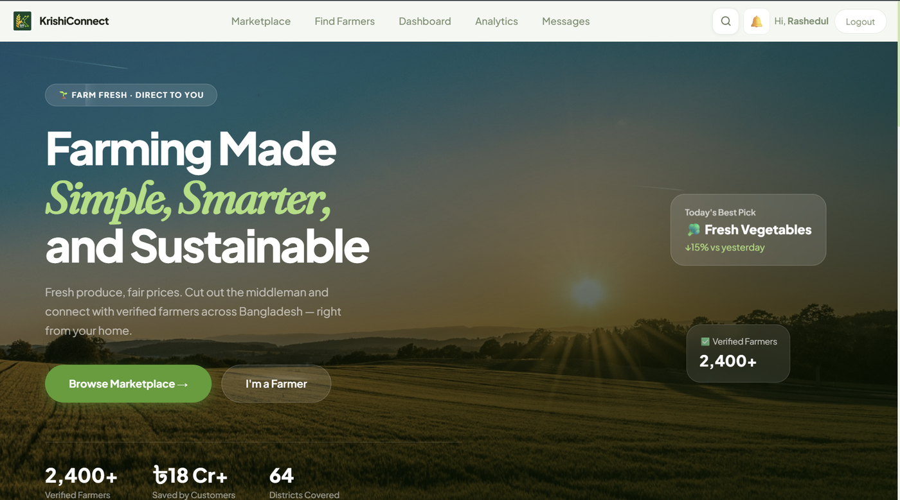
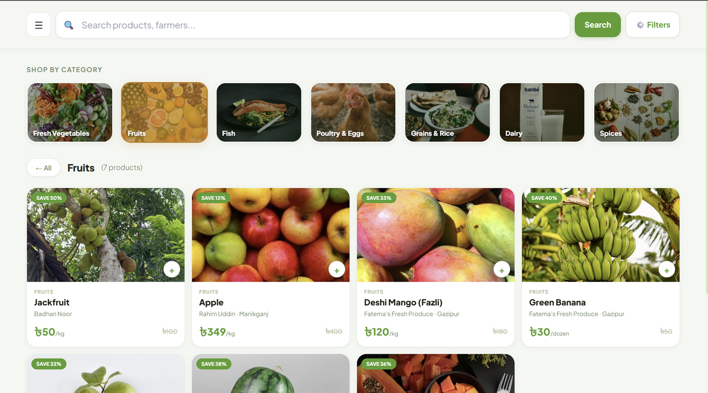
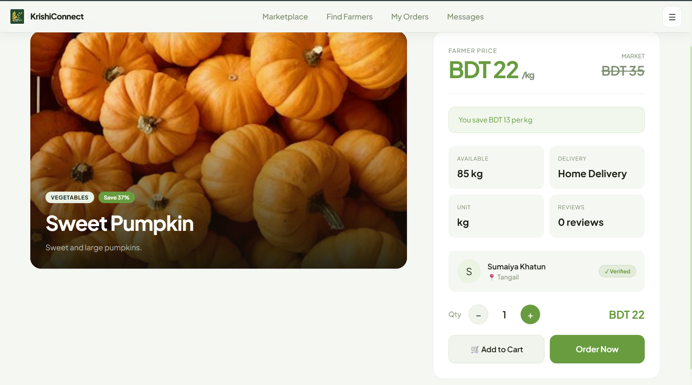
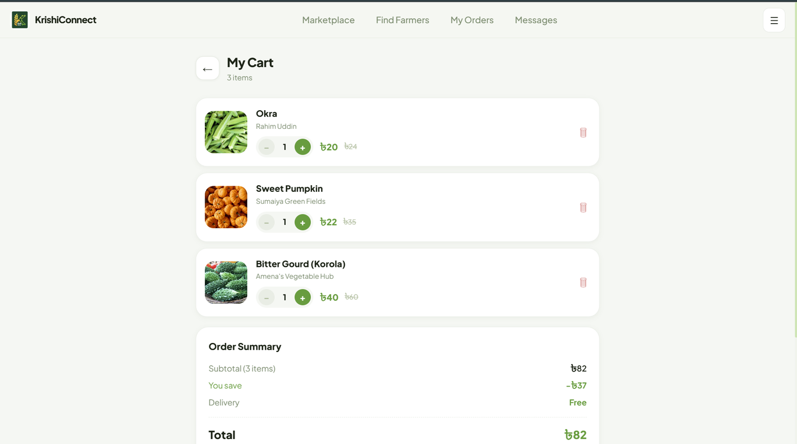
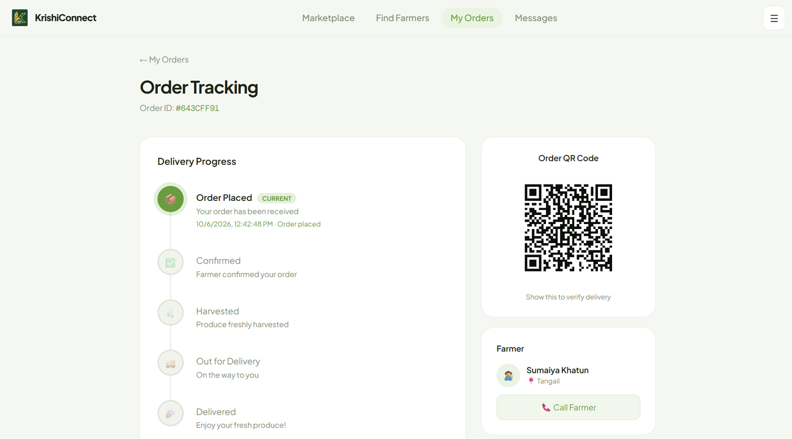
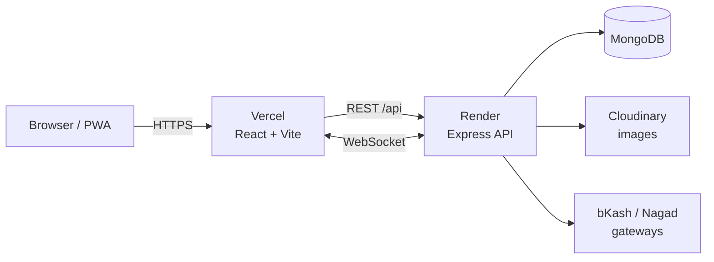
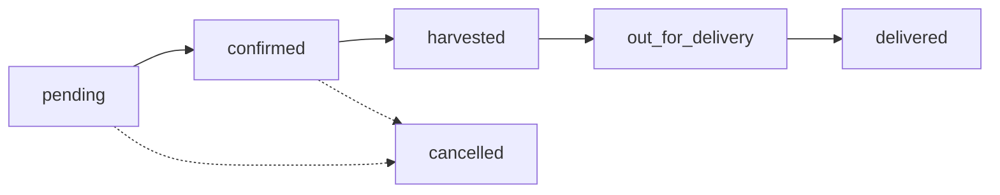

<div align="center">

# 🌾 KrishiConnect

**Farm fresh, direct to you.**
A full-stack marketplace connecting Bangladeshi farmers directly with customers, with no middlemen, fairer prices, and fresher produce.

[**🌐 Live Demo**](https://krishi-connect-eta.vercel.app) · [**📡 API**](https://krishiconnect-api-0lff.onrender.com) · [**🐛 Report a Bug**](https://github.com/RashedulIslamTasif/KrishiConnect/issues)


</div>
---

## 📖 About

Farmers in Bangladesh often lose a large share of their income to middlemen, while customers pay more for produce that has traveled through several hands. **KrishiConnect** lets farmers list their harvest and sell directly, with real-time chat, mobile payments (bKash and Nagad), order tracking, price comparison against market rates, and admin-verified farmer profiles to build trust.

## 📸 Screenshots

<table>
  <tr>
    <td align="center"><b>Home</b><br></td>
    <td align="center"><b>Marketplace</b><br></td>
  </tr>
  <tr>
    <td align="center"><b>Product Details</b><br></td>
    <td align="center"><b>Cart</b><br></td>
  </tr>
  <tr>
    <td align="center" colspan="2"><b>Order Tracking</b><br></td>
  </tr>
</table>

---

## 🔗 Live Deployment

| Service | Platform | URL |
|---------|----------|-----|
| Frontend | Vercel | https://krishi-connect-eta.vercel.app |
| Backend API | Render | https://krishiconnect-api-0lff.onrender.com |

---

## ✨ Features

| 🛒 Customers | 🚜 Farmers | 🛡 Admin |
|---|---|---|
| Browse by category, location, and price | Product management with up to 5 images | Review farmer verification requests |
| Farmer vs. market price with savings badge | Stock, harvest date, and pre-order support | Approve or reject with a reason |
| Price history charts | Order management and status updates | Admin account auto-created on first start |
| Pre-order upcoming harvests | Sales analytics dashboard and KPIs | |
| Cart, coupons, and checkout | Record prices vs. market | |
| bKash, Nagad, or Cash on Delivery | Create discount coupons | |
| Live order tracking timeline | NID and selfie verification for a verified badge | |
| Real-time chat with farmers | Real-time chat with customers | |
| Reviews and ratings | Public profile with ratings | |
| Personalized recommendations | | |
| Farmer discovery map | | |

**Platform-wide:** live notifications (Socket.io) · installable PWA · responsive UI · JWT auth with role-based access.

---

## 🏗 Architecture



## 🧰 Tech Stack

| Layer | Technologies |
|-------|--------------|
| **Frontend** | React 18, Vite 5, React Router 6, Tailwind CSS 3, Framer Motion, Recharts, Leaflet, Axios, Socket.io Client |
| **Backend** | Node.js, Express 4, Mongoose 8, Socket.io 4, JWT, bcryptjs, Multer |
| **Services** | MongoDB, Cloudinary, bKash Tokenized Checkout, Nagad Gateway |
| **Hosting** | Vercel (client), Render (API) |

---

## 📁 Project Structure

```
KrishiConnect/
├── client/                  # React + Vite frontend
│   ├── public/              # PWA manifest, service worker, icons
│   └── src/
│       ├── api/             # Axios instance
│       ├── components/      # Navbar, ProductCard, NotificationBell, CouponInput, ...
│       ├── context/         # Auth and Cart state
│       ├── hooks/           # useSocket, useResponsive
│       ├── pages/           # Customer pages + farmer/ dashboard pages
│       └── routes/          # PrivateRoute, FarmerRoute
└── server/                  # Express backend
    ├── config/              # DB connection
    ├── controllers/         # Business logic
    ├── middleware/          # protect (JWT), authorizeRole
    ├── models/              # Mongoose schemas
    ├── routes/              # One router per resource
    ├── utils/               # Cloudinary, admin seeder
    ├── seed.js              # Demo data seeder
    └── server.js            # Entry point + Socket.io
```

---

## 🚀 Getting Started

**Prerequisites:** Node.js 18+, a MongoDB database (local or Atlas), a Cloudinary account. bKash and Nagad sandbox keys are optional.

```bash
# 1. Clone
git clone https://github.com/RashedulIslamTasif/KrishiConnect.git
cd KrishiConnect

# 2. Backend
cd server
npm install
cp .env.example .env     # then fill in your values
npm run dev              # http://localhost:5000

# 3. Frontend (new terminal)
cd client
npm install
npm run dev              # http://localhost:5173
```

In development, Vite proxies `/api` and `/socket.io` to `localhost:5000`, so the client needs no extra configuration.

### Environment Variables

<details>
<summary><b>Server: <code>server/.env</code></b></summary>

```env
PORT=5000
NODE_ENV=development
FRONTEND_URL=http://localhost:5173

MONGO_URI=
JWT_SECRET=
JWT_EXPIRE=30d

CLOUDINARY_CLOUD_NAME=
CLOUDINARY_API_KEY=
CLOUDINARY_API_SECRET=

# Admin account, auto-created on server start
ADMIN_EMAIL=
ADMIN_PASSWORD=
```

> **Optional:** bKash and Nagad credentials (`BKASH_*`, `NAGAD_*`) are only needed to test online payments. Without them, the app still works fully with **Cash on Delivery**.

</details>

<details>
<summary><b>Client: <code>client/.env</code></b></summary>

```env
# Only needed when the API is on another origin (production).
# If unset, the client uses "/api" (works with the Vite dev proxy).
VITE_API_URL=https://krishiconnect-api-0lff.onrender.com/api
```

</details>

### Demo Data (optional)

```bash
cd server && npm run seed
```

> ⚠️ This **deletes** all users, products, orders, reviews, and price history before inserting sample data. Use it on a development database only.

---

## 🔌 API Reference

Base path: `/api`. 🔒 = requires `Authorization: Bearer <token>`.

<details>
<summary><b>Auth</b> · <code>/api/auth</code></summary>

| Method | Endpoint | Access | Description |
|--------|----------|--------|-------------|
| POST | `/register` | Public | Register |
| POST | `/login` | Public | Log in |
| GET | `/me` | 🔒 | Current user |
| PUT | `/profile` | 🔒 | Update profile / avatar |
| PUT | `/change-password` | 🔒 | Change password |
| POST | `/verify-nid` | 🔒 Farmer | Submit NID + selfie |
| GET | `/farmers` · `/farmers/:id` | Public | Browse farmers |
| GET | `/admin/verifications` | 🔒 Admin | Pending verifications |
| PATCH | `/admin/farmers/:id/verify` | 🔒 Admin | Approve / reject |

</details>

<details>
<summary><b>Products</b> · <code>/api/products</code></summary>

| Method | Endpoint | Access | Description |
|--------|----------|--------|-------------|
| GET | `/` | Public | List (filters: `category`, `location`, `minPrice`, `maxPrice`, `limit`) |
| GET | `/:id` | Public | Details |
| GET | `/farmer/mine` | 🔒 Farmer | My products |
| POST | `/` | 🔒 Farmer | Create (up to 5 `images`) |
| PUT | `/:id` | 🔒 Farmer | Update |
| DELETE | `/:id` | 🔒 Farmer | Delete |

</details>

<details>
<summary><b>Orders</b> · <code>/api/orders</code></summary>

| Method | Endpoint | Access | Description |
|--------|----------|--------|-------------|
| POST | `/` | 🔒 Customer | Place order |
| GET | `/my` | 🔒 Customer | My orders |
| GET | `/farmer` | 🔒 Farmer | Orders received |
| GET | `/:id` | 🔒 | Order details |
| PUT | `/:id/status` | 🔒 Farmer | Update status |
| PUT | `/:id/payment-method` | 🔒 Customer | Change payment method |

</details>

<details>
<summary><b>Payments</b> · <code>/api/payment</code></summary>

| Method | Endpoint | Access | Description |
|--------|----------|--------|-------------|
| POST | `/bkash/create` | 🔒 | Start bKash payment |
| GET | `/bkash/callback` | Gateway | bKash callback |
| GET | `/bkash/verify/:orderId` | 🔒 | Verify bKash payment |
| POST | `/nagad/create` | 🔒 | Start Nagad payment |
| GET | `/nagad/callback` | Gateway | Nagad callback |
| GET | `/nagad/verify/:orderId` | 🔒 | Verify Nagad payment |
| POST | `/refund/:orderId` | 🔒 | Refund |

</details>

<details>
<summary><b>Reviews & Prices</b> · <code>/api/reviews</code>, <code>/api/prices</code></summary>

| Method | Endpoint | Access | Description |
|--------|----------|--------|-------------|
| POST | `/api/reviews` | 🔒 Customer | Create review |
| GET | `/api/reviews/my` | 🔒 Customer | My reviews |
| GET | `/api/reviews/product/:productId` | Public | Product reviews |
| GET | `/api/reviews/farmer/:farmerId` | Public | Farmer reviews |
| GET | `/api/prices/all` | Public | Latest prices |
| GET | `/api/prices/:productName` | Public | Price history |
| POST | `/api/prices` | 🔒 Farmer | Record a price |

</details>

<details>
<summary><b>Chat, Notifications, Coupons, Analytics</b></summary>

| Method | Endpoint | Access | Description |
|--------|----------|--------|-------------|
| GET | `/api/chat/conversations` | 🔒 | My conversations |
| POST | `/api/chat/start` | 🔒 | Start / get conversation |
| GET | `/api/chat/unread` | 🔒 | Unread count |
| GET · POST | `/api/chat/:conversationId/messages` | 🔒 | Read / send messages |
| GET | `/api/notifications` | 🔒 | My notifications |
| GET | `/api/notifications/unread-count` | 🔒 | Unread count |
| PUT | `/api/notifications/read-all` | 🔒 | Mark all read |
| PUT | `/api/notifications/:id/read` | 🔒 | Mark one read |
| POST | `/api/coupons/validate` | 🔒 | Validate coupon |
| POST | `/api/coupons/apply` | 🔒 | Apply coupon |
| GET · POST | `/api/coupons` · `/api/coupons/mine` | 🔒 Farmer/Admin | List / create |
| DELETE | `/api/coupons/:id` | 🔒 Farmer/Admin | Delete |
| GET | `/api/analytics/farmer` | 🔒 Farmer | Dashboard data |
| GET | `/api/analytics/recommendations/:userId` | 🔒 | Recommendations |

</details>

<details>
<summary><b>Socket.io events</b></summary>

| Event | Direction | Description |
|-------|-----------|-------------|
| `join` | Client → Server | Join personal room (user ID) |
| `join_conversation` | Client → Server | Join a chat room |
| `typing` / `stop_typing` | Client → Server | Typing indicators |
| `new_message` | Server → Client | New chat message |
| `notification` | Server → Client | New notification |

</details>

---

## 📦 Order Lifecycle



Every status change is recorded in the order's `statusHistory`, and the customer is notified instantly through Socket.io.

---

## ☁️ Deployment

**Backend → Render** (`server/render.yaml`)
- Build: `npm install` · Start: `node server.js`
- Add every variable from the server `.env` in the Render dashboard, and set `FRONTEND_URL` to your Vercel URL.
- Set your bKash and Nagad callback URLs to the deployed API.

**Frontend → Vercel**
- Root directory: `client` · Build: `npm run build` · Output: `dist`
- Set `VITE_API_URL` to `https://krishiconnect-api-0lff.onrender.com/api`.
- `client/vercel.json` rewrites all routes to `index.html` for SPA routing.

---

## 🔒 Security

- Passwords are hashed with bcrypt; authentication uses JWT.
- Secrets live in environment variables only. `.env` files are git-ignored, so never commit them.
- NID and selfie images are sensitive personal data. Handle them with care and restrict access to admin review only.

---

## 👤 Author

**Md Rashedul Islam**, Bangladesh University of Professionals
GitHub: [@RashedulIslamTasif](https://github.com/RashedulIslamTasif)